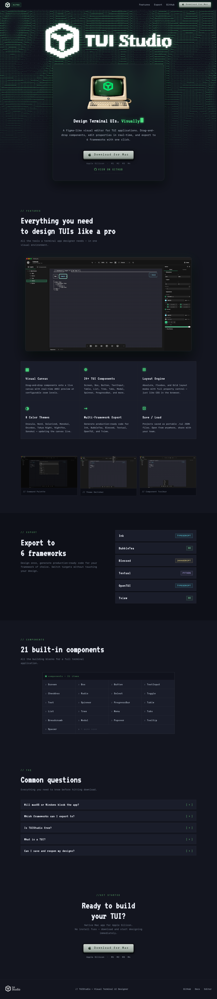

# TUIStudio Landing Page

Marketing landing page for [TUIStudio](https://tuistudio.app) — a Figma-like visual editor for Terminal UI (TUI) applications.



## Stack

Plain HTML + CSS + vanilla JS. No build step, no framework, no dependencies.

- `index.html` — full landing page (styles inlined)
- `neon-glass.css` / `neon-glass.js` — reusable keycap button and toggle switch components

## Development

Serve the root directory with any static file server:

```bash
python3 -m http.server 8080
# or
npx serve .
```

Then open `http://localhost:8080`.

## Neon Glass components

Two reusable UI components with a retro terminal aesthetic:

**Button** — raised keycap style with pixel particle effects on hover/click:

```html
<div class="ng-platform ng-platform--primary">
  <button class="ng-btn">
    <span class="ng-btn-shine"></span>
    <span class="ng-btn-label">Download</span>
  </button>
</div>
```

**Switch** — toggle with animated neon glow:

```html
<div class="ng-switch-row">
  <label class="ng-switch">
    <input type="checkbox" />
    <div class="ng-switch-track"></div>
    <div class="ng-switch-thumb"></div>
  </label>
  <span class="ng-switch-label">OFF</span>
</div>
```

Initialize with:

```js
NeonGlass.init(); // auto-binds all .ng-btn and .ng-switch on the page
```
